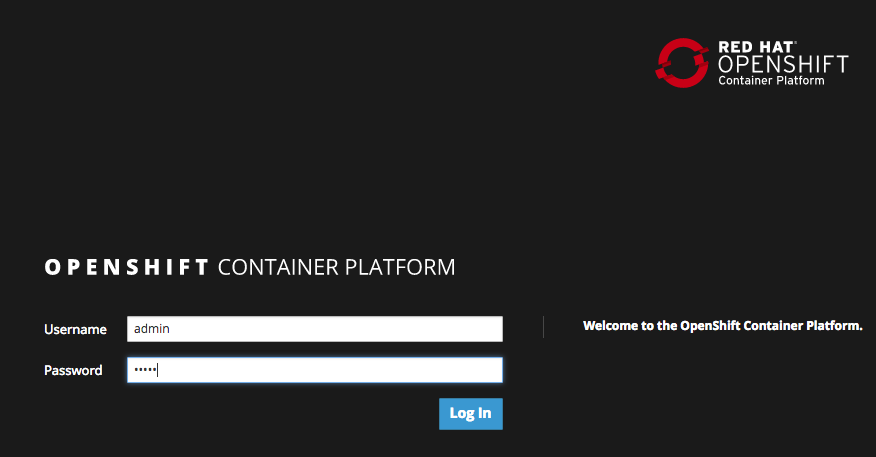
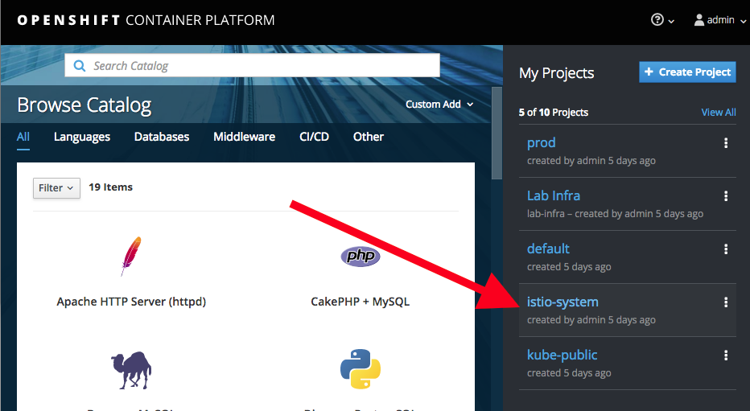
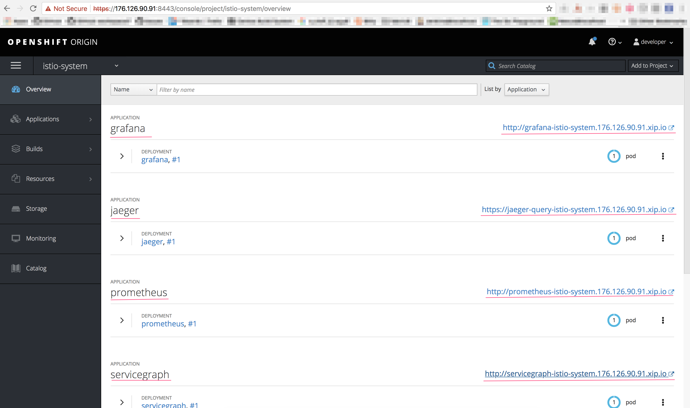
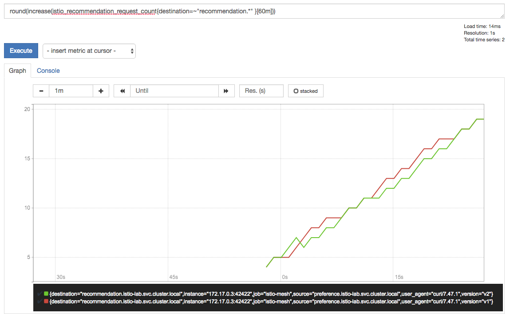
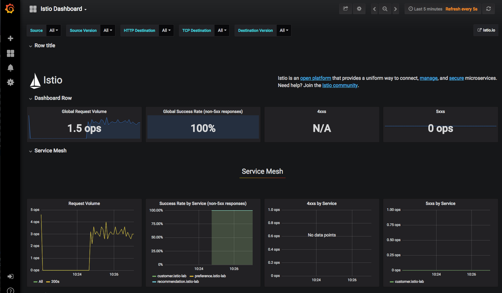
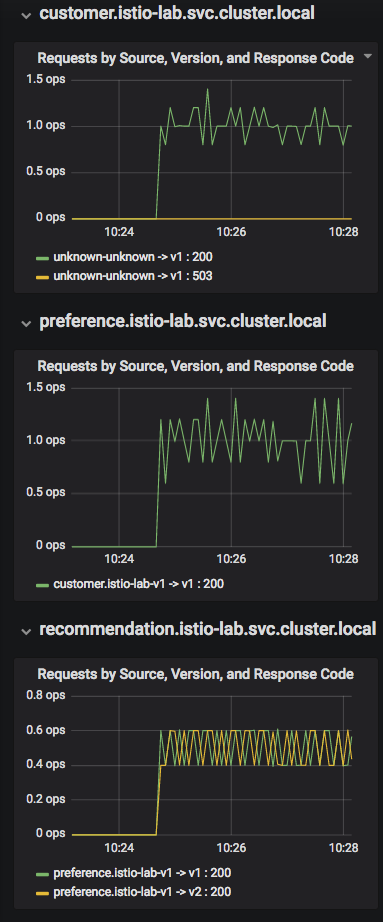
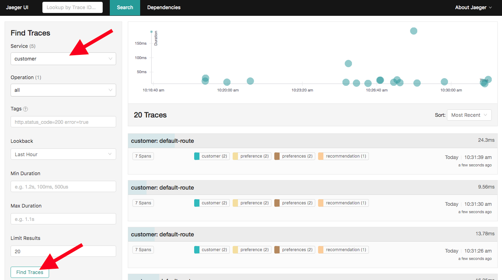
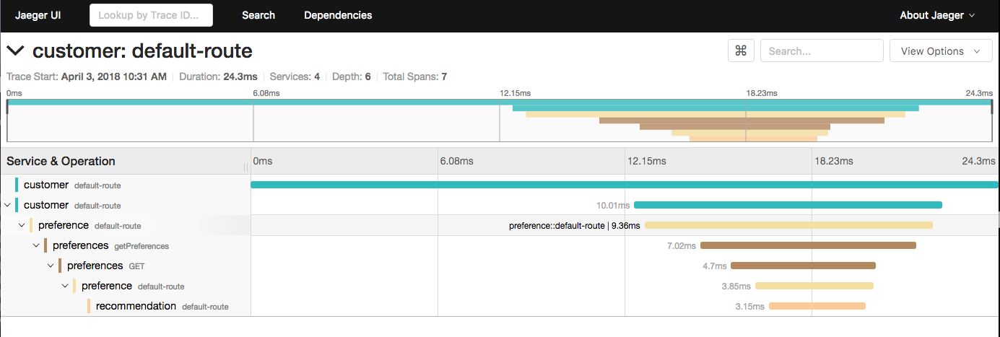

<div>
 <div style="float: left"><a href="./01-basic-routing.md"><span>&lt;&lt;&nbsp;Previous</span></a></div>
<div style="float: right"><a href="./03-fault-injection.md"><span>Next&nbsp;&gt;&gt;</span></a></div>
<div>
<br/>

# Service Mesh Visualizations and Tracing

In this exercise you'll look at some of the out-of-the-box tools that
Istio provides for visualizing the service mesh, querying for telemetry, and
monitoring/visualizing the traffic. This is very useful for debugging and improving
existing apps without having to echange them.

## What you will learn

* How to access various consoles (OpenShift Web Console, tracing, monitoring, visualization)
* How to use these to improve your app performance and architecture

## Access OpenShift Web Console

OpenShift also provides a feature rich Web Console that provides a friendly graphical interface for
interacting with the platform. The URL for your web console can be seen using the following command:

```bash
# oc cluster status

Web console URL: https://xx.xx.xx.xx:8443/console/
...
```

Open the web console URL in your browser, accept the self-signed certificate warning,
and you'll arrive at the login screen. Login with:

* **Username**: `admin`
* **Password**: `admin`



Once logged in, click on the `istio-system` project on the right:



> NOTE: If you do not see the `istio-system` project, you may need to click on `View All`!

Make a note of the `grafana`, `jaeger-query`, `prometheus` and `servicegraph` console URLs for your respective environment.  The following screenshot shows how to find them via OpenShift web console:



These endpoints can also be listed using the `oc` command:

```bash
oc get route -n istio-system
```

## Visualize the network

The Servicegraph service is an example service that provides endpoints for generating and visualizing a graph of services within a mesh. It exposes the following endpoints:

* `/graph` which provides a JSON serialization of the servicegraph
* `/dotgraph` which provides a dot serialization of the servicegraph
* `/force` which provides a [D3.js](https://d3js.org/)-based dynamic representation of the servicegraph
* `/dotviz` which provides a static representation of the servicegraph

## Examine Service Graph

Open the service graph url in Web Browser, get the servicegraph application url via the console and open it in the browser by adding the path  `/forcegraph.html?time_horizon=5m&filter_empty=true`.

e.g. a typical url will be like `http://servicegraph-istio-system.176.126.90.91.xip.io/force/forcegraph.html?time_horizon=5m&filter_empty=true`

It should look like:


This shows you a graph of the services and how they are connected, with some basic access metrics like
how many requests per second each service receives.

As you add and remove services over time in your projects, you can use this to verify the connections between services and provides
a high-level telemetry showing the rate at which services are accessed.

## Generating application load

To get a better idea of the power of metrics, let's setup an endless loop that will continually access
the application and generate load. We'll open up a separate terminal just for this purpose. Execute this command:

```bash
while true; do
  curl "http://$(oc get route customer -n ${ISTIO_LAB_PROJECT} --template='{{ .spec.host }}')"
  sleep .5
done
```

> NOTE: After opening a new terminal window you will need to connect to your lab machine before issuing the
above commands. Refer to the [Introduction](00-intro.md#opening-more-terminals) section for details on opening new terminals.

This command will endlessly access the application and report the HTTP status result in a separate terminal window.

With this application load running, metrics will become much more interesting in the next few steps.

## Querying Metrics with Prometheus

[Prometheus](https://prometheus.io/) exposes an endpoint serving generated metric values. The Prometheus
add-on is a Prometheus server that comes pre-configured to scrape Mixer endpoints
to collect the exposed metrics. It provides a mechanism for persistent storage
and querying of Istio metrics. Istio also allows you to specify custom metrics which
can be seen inside of the Prometheus dashboard.

First, add a custom metric:

```bash
oc create -f ${ISTIO_LAB_HOME}/src/istiofiles/recommendation_requestcount.yml -n istio-system
```

Open the Prometheus url in Web Browser, get the prometheus application url via the console and open it in the browser.

e.g. a typical url will be like `http://prometheus-istio-system.176.126.90.91.xip.io`

In the “Expression” input box at the top of the web page, enter the text:
`round(increase(istio_recommendation_request_count{destination=~"recommendation.*" }[60m]))`

Then, click the **Execute** button, and then the **Graph** tab. You should see the graph of the number of accesses to
the `recommendation` service (you may need to adjust the interval to `5m` (5 minutes) as seen in the screenshot)



Other expressions to try:

* Total count of all requests to `v2` of the `recommendation` service: `istio_request_count{destination_service=~"recommendation.*", destination_version="v2"}`
* Rate of requests over the past 5 minutes to all `preference` services: `rate(istio_request_count{destination_service=~"preference.*", response_code="200"}[5m])`

There are many, many different queries you can perform to extract the data you need. Consult the
[Prometheus documentation](https://prometheus.io/docs) for more detail.

## Visualizing Metrics with Grafana

As the number of services and interactions grows in your application, this style of metrics may be a bit
overwhelming. [Grafana](https://grafana.com/) provides a visual representation of many available Prometheus
metrics extracted from the Istio data plane and can be used to quickly spot problems and take action.

Open the Grafana url in Web Browser, get the grafana application url via the console and open it in the browser by adding the following extra path to it `/dashboard/db/istio-dashboard`

e.g. a typical url will be like `http://grafana-istio-system.176.126.90.91.xip.io/dashboard/db/istio-dashboard`



The Grafana Dashboard for Istio consists of three main sections:

1. **A Global Summary View.** This section provides high-level summary of HTTP requests flowing through the service mesh.
1. **A Mesh Summary View.** This section provides slightly more detail than the Global Summary View, allowing per-service filtering and selection.
1. **Individual Services View.** This section provides metrics about requests and responses for each individual service within the mesh (HTTP and TCP).

Scroll down to the see the stats for the `customer`, `preference` and `recommendation` services:



These graph shows which other services are accessing each service. You can see that
the `preference` service is calling the `recommendation:v1` and `recommendation:v2` service
equally, since the default routing is _round-robin_.

For more on how to create, configure, and edit dashboards, please see the [Grafana documentation](http://docs.grafana.org/).

As a developer, you can get quite a bit of information from these metrics without doing anything to the application
itself. Let's use our new tools in the next section to see the real power of Istio to diagnose and fix issues in
applications and make them more resilient and robust.

## Tracing service calls using Jaeger OpenTracing

At the highest level, a trace tells the story of a transaction or workflow as
it propagates through a (potentially distributed) system. A trace is a directed
acyclic graph (DAG) of _spans_: named, timed operations representing a
contiguous segment of work in that trace.

Distributed tracing speeds up troubleshooting by allowing developers to quickly understand
how different services contribute to the overall end-user perceived latency. In addition,
it can be a valuable tool to diagnose and troubleshoot distributed applications.

Tracing in Istio requires you to pass a set of headers to outbound requests. It can be done manually
or by using the OpenTracing framework instrumentations such as [opentracing-spring-cloud](https://github.com/opentracing-contrib/java-spring-cloud). Framework instrumentation
automatically propagates tracing headers and also creates in-process spans to better understand what is
happening inside the application.

There are different ways to configure the tracer. The _Customer_ Java service in this lab is using [tracerresolver](https://github.com/jaegertracing/jaeger-client-java/tree/master/jaeger-tracerresolver)
which does not require any code changes and the whole configuration is defined in environmental variables whose names
begin with `JAEGER_`. Run this command to execute the `env` command inside the running container to see them:

```bash
oc rsh -c customer $(oc get pods --selector app=customer -o jsonpath='{.items[?(@.status.phase=="Running")].metadata.name}') env | grep JAEGER_
```

Whereas the _Preference_ Java service is instantiating the tracer bean directly in its Spring configuration class
in `$ISTIO_LAB_HOME/src/preference/src/main/java/com/redhat/developer/demos/preference/PreferencesApplication.java`.

First, open the Jaeger console:

Open the Jaeger url in Web Browser, get the Jaeger UI application url via the console and open it in the browser.

e.g. a typical url will be like `http://jaeger-query-istio-system.176.126.90.91.xip.io`

Next, select _customer_ in the **Service** drop-down, and then click **Find traces**. You should see a list of recent
traces:



Click on one of them to display detailed info, showing the access from `customer` -> `preference` -> `recommendation` and the
time each call took:



This can be useful in identifying critical paths and bottlenecks in your apps, and make architectural
improvements to increase performance or fix timing or other issues in your code.

## Cleanup

Stop the endless `curl` loop with `CTRL-C` in the running terminal (or just close the window).

# References

* [Red Hat OpenShift](https://openshift.com)
* [Learn Istio on OpenShift](https://learn.openshift.com/servicemesh)
* [Istio Homepage](https://istio.io)

<div>
 <div style="float: left"><a href="./01-basic-routing.md"><span>&lt;&lt;&nbsp;Previous</span></a></div>
<div style="float: right"><a href="./03-fault-injection.md"><span>Next&nbsp;&gt;&gt;</span></a></div>
<div>